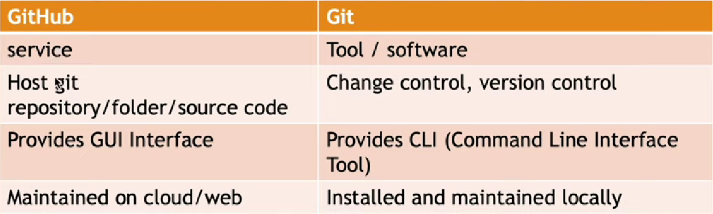
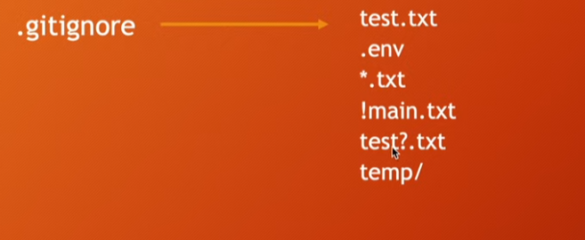

# Git Version Control Documentation

This documentation provides a comprehensive guide to using Git for version control, including configuration, common commands, and key concepts. It also covers basic differences between Git and GitHub, along with some important concepts for staging, committing, and undoing changes.

## Table of Contents
- [Git Version Control Documentation](#git-version-control-documentation)
  - [Table of Contents](#table-of-contents)
  - [Introduction](#introduction)
  - [Version Control Systems](#version-control-systems)
  - [Difference Between Git and GitHub](#difference-between-git-and-github)
  - [Git Configuration](#git-configuration)
    - [Global Configuration](#global-configuration)
    - [Local Configuration](#local-configuration)
  - [Working with SSH Key](#working-with-ssh-key)
  - [Staging and Unstaging Files](#staging-and-unstaging-files)
  - [Committing Changes](#committing-changes)
  - [Undoing Commits](#undoing-commits)
  - [Git Ignore](#git-ignore)
  - [Footer](#footer)

## Introduction

This documentation provides step-by-step instructions on how to set up Git, use common Git commands, and work with version control systems efficiently. Whether you are new to Git or looking to refine your Git skills, this guide will help you get started.

## Version Control Systems

Here are some popular version control systems:

1. GitLab
2. Beanstalk
3. Perforce
4. BitBucket

## Difference Between Git and GitHub

- **Git**: A version control system that manages and tracks changes in source code.
- **GitHub**: A platform for hosting Git repositories and collaborating with other developers.



## Git Configuration

### Global Configuration

Set up your Git globally with the following commands:

```bash
git config --global user.name "your name"
git config --global user.email "your email"
```

To view your configuration:

```bash
git config --list
```

### Local Configuration

To configure Git locally for a specific repository:

```bash
git config --local user.name "your name"
git config --local user.email "your email"
```

If needed, unset a global configuration:

```bash
git config --global unset user.email "your email"
```

## Working with SSH Key

To view all hidden files including SSH keys, run:

```bash
Get-ChildItem -Force F:\Ehsan\complete-git
```

## Staging and Unstaging Files

Here are some useful commands for staging and unstaging files:

- Stage a specific file:

  ```bash
  git add filename
  ```

- Stage all changed files:

  ```bash
  git add -A
  ```

- Stage all changed files in the current directory (excluding subdirectories):

  ```bash
  git add .
  ```

- Stage all `.js` files:

  ```bash
  git add *.js
  ```

- Stage all `.js` files in directories and subdirectories:

  ```bash
  git add **/*.js
  ```

## Committing Changes

Once files are staged, you can commit them with a message:

```bash
git commit -m "message here"
```

To stage and commit in one step:

```bash
git commit -am "message here"
```

To view commit history:

```bash
git log        # Full descriptive history
git log --oneline # Short description history
```

## Undoing Commits

Several ways to undo commits in Git:

- Undo the last commit but keep changes staged:

  ```bash
  git reset --soft HEAD^
  ```

- Undo the last commit and unstage changes:

  ```bash
  git reset HEAD^
  ```

- Completely undo the last commit and discard changes:

  ```bash
  git reset --hard HEAD^
  ```

You can also view and switch to individual commit heads:

```bash
git show cmidname
git checkout cmidname
```

## Git Ignore

Git uses the `.gitignore` file to exclude specific files or directories from version control. Below are some patterns commonly used in `.gitignore`:

- Ignore specific files:

  ```
  test.txt
  .env
  ```

- Ignore all `.txt` files:

  ```
  *.txt
  ```

- Do not ignore `main.txt` even if all `.txt` files are ignored:

  ```
  !main.txt
  ```

- Ignore files matching a pattern:

  ```
  test?.txt # Matches test1.txt, test2.txt, etc.
  ```

- Ignore directories:

  ```
  temp/
  ```



## Footer

&copy; 2024 Git Documentation. All rights reserved.
